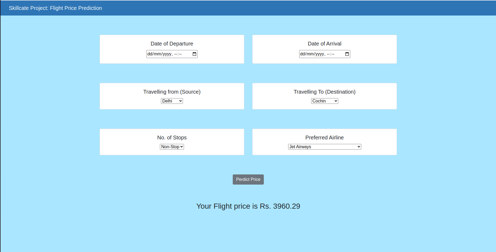

# Flight Fare Prediction
* Flight fare prediction is a classical problem of time series forecasting that finds trends in past observations to outline the future
* Many popular flight booking websites today, including Google Flights, showcase important insights on:
  * Current fair status: high, low or fair
  * Past fare trends, upcoming future trends and 
  * Helps decide the right time to book a flight ticket.
* In this project, we are going to build a Python Flight Fare Prediction App, that returns the fare prediction for a given set of travel details, like:  departure date, arrival date, departure city, arrival city, stoppages, and the airline carrier.

## App Live Pic

## Steps to run Flight Fare App - on Windows

* Prerequisites: [Python 3.9](https://www.python.org/downloads/) (ensure Python is added to [PATH](https://medium.com/co-learning-lounge/how-to-download-install-python-on-windows-2021-44a707994013)) + [Git](https://git-scm.com/downloads) Client 
* Open GIT CMD >> navigate to working directory >> Clone this Github Repo (or download project files from GitHub directly)

      git clone https://github.com/IIT-BHU-inter-IIT-SDE-group-8/flight-ml.git 
* Open Windows Powershell >> navigate to new working directory (cloned repo folder)
* Run Project in Flask (Using PIP + Virtualenv)
 
        pip install virtualenv                  # install virtual environment        
        virtualenv ENV                          # create virtual environment by the name ENV
        .\ENV\Scripts\activate                  # activate ENV
        pip install -r .\requirements.txt       # install project dependencies
        python app.py                           # run the project
        deactivate                              # close virtual environment once done
  

### Steps to run Flight Fare App - on Mac

* Prerequisites: [Python 3.9](https://www.python.org/downloads/)
* Open Terminal >> navigate to working directory >> Clone this Github Repo (or download project files from GitHub directly)

        git clone https://github.com/IIT-BHU-inter-IIT-SDE-group-8/flight-ml.git 
* Navigate to project working directory (cloned repo folder)
* Run Project in Flask (Using PIP + Virtualenv)

        pip install virtualenv                  # install virtual environment
        virtualenv ENV                          # create virtual environment by the name ENV
        source ENV/bin/activate                 # activate ENV
        pip install -r requirements.txt         # install project dependencies
        python app.py                           # run the project
        deactivate                              # close virtual environment once done
        

